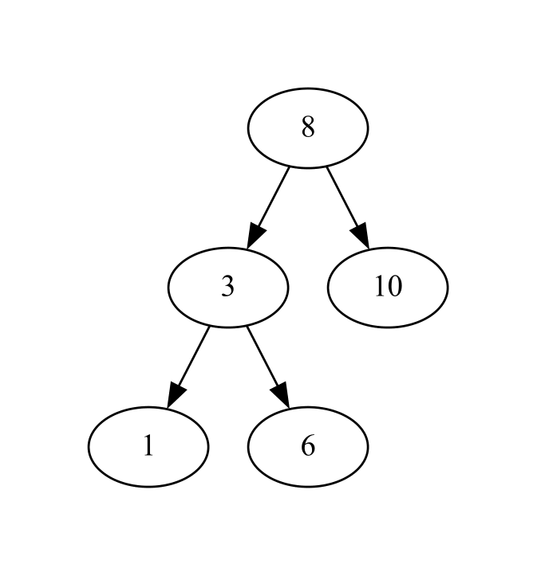
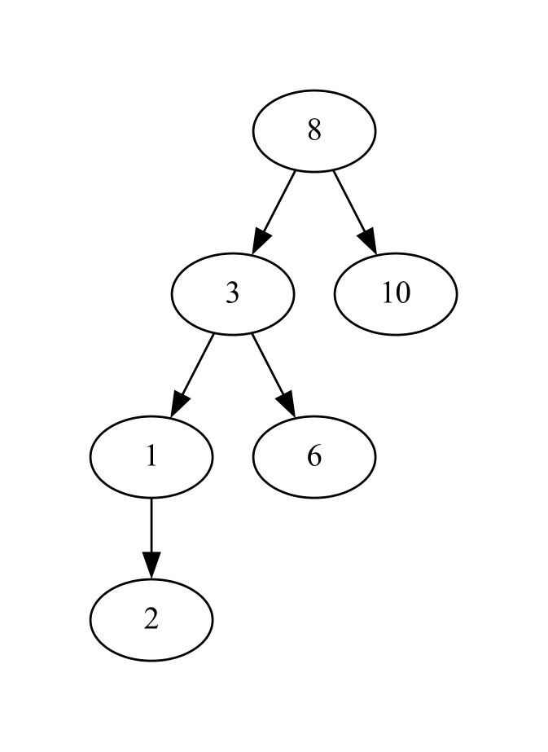

# seealgo
A Python library to visualize a data structure as it changes throughout a function

[](./LICENSE) 


[](https://github.com/sarahtang7/seealgo/actions/workflows/main.yml)
[](https://pypi.org/project/seealgo/)
[](https://sarahtang7.github.io/seealgo/)

## Overview
When writing algorithms, I often find that visualizing the data structures are necessary, but it can be difficult and time-consuming to do so. The goal of the seealgo library is to allow users to visualize a given data structure as it changes in a given function.

So far, the seealgo library provides visualization for the following data structures and methods:
- List: `append(value)`, `insert(index, value)`, `remove(value)`, `__setitem__(index, value)`
- Binary Search Tree (provided as a nested dictionary): `insert(child)`, `remove(value)` 
- Set: `add(value)`, `remove(value)`, `clear()`, `update(values)`
- Dictionary (nested and non-nested): `update(iterable)`, `pop(key)`

## Installation
This library requires you to have `graphviz` installed on your system using the [instructions](https://graphviz.org/download/) appropriate for your system, or by using the following command if you are on a macOS device: 
```
brew install graphviz
```
Then, install `seealgo` using the following command:
```
pip install seealgo
```

## Using seealgo
(for examples of all data structures available with seealgo, visit our [GitHub Pages](https://sarahtang7.github.io/seealgo/)!)

This is an example of using the List module to visualize appending 5 to a list:

```python
from seealgo import List

visual_list = List()
test_list = [1, 2, 3, 4]

def append_to_list(input_list):
  input_list.append(5)
  return input_list

visual_list.see(append_to_list, test_list)
```


This is an example of using the Tree module to visualize adding a leaf node with value 2 to a binary search tree: 

```python
from seealgo import Tree

visual_tree = Tree()

test_tree = {
    '8': {
        '3': {
            '1': None,
            '6': None
        },
        '10': None
    }
}

def insert_func(init_tree):
    init_tree.add_child(2)
    return init_tree

visual_tree.see(insert_func, test_tree)
```


