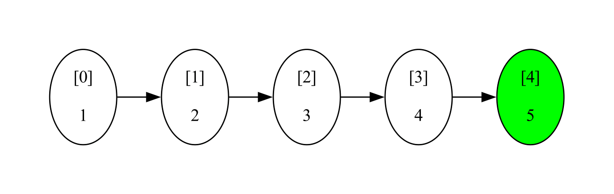

# seealgo
A Python library to visualize a data structure as it changes throughout a function

[](./LICENSE) 


[](https://github.com/sarahtang7/seealgo/actions/workflows/main.yml)

## Overview
When writing algorithms, I often find that visualizing the data structures are necessary, but it can be difficult and time-consuming to do so. The goal of the seealgo library is to allow users to visualize a given data structure as it changes in a given function.

## Installation
This library requires you to have `graphviz` installed on your system using the [instructions](https://graphviz.org/download/) appropriate for your system, or by using the following command if you are on a macOS device: 
```
brew install graphviz
```
Then, install `seealgo` using the following command:
```
pip install seealgo
```

## Using seealgo
```python
from seealgo import List

visual_list = List()
test_list = [1, 2, 3, 4]

def append_to_list(input_list):
  input_list.append(5)
  return input_list

visual_list.see(append_to_list, test_list)
```


